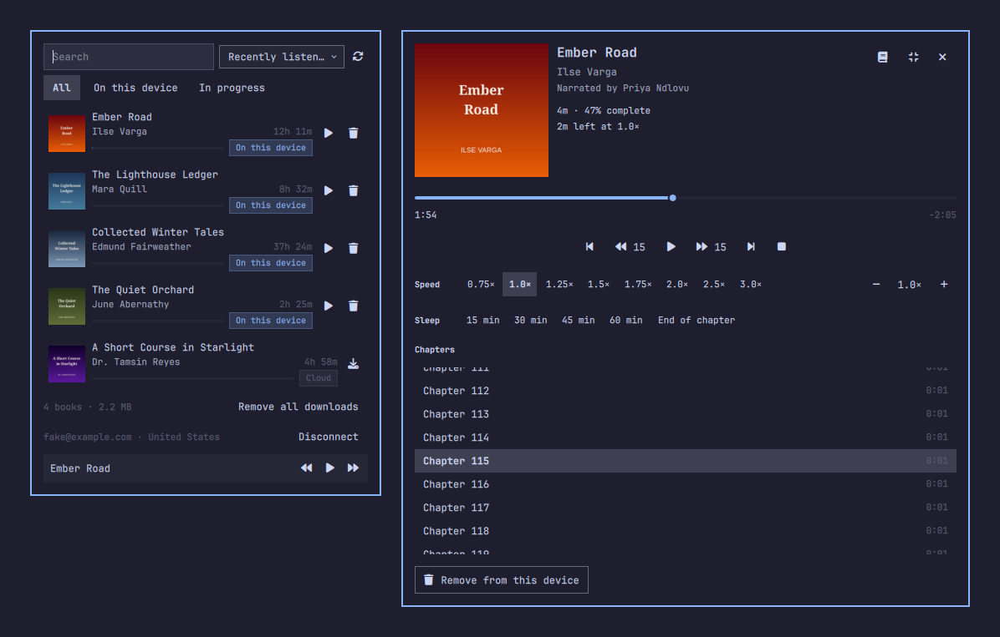
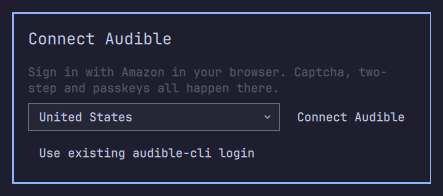
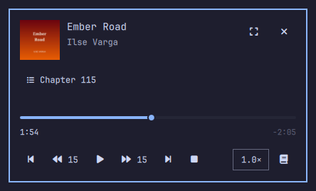
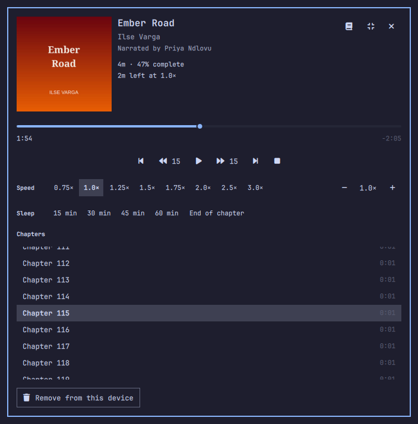
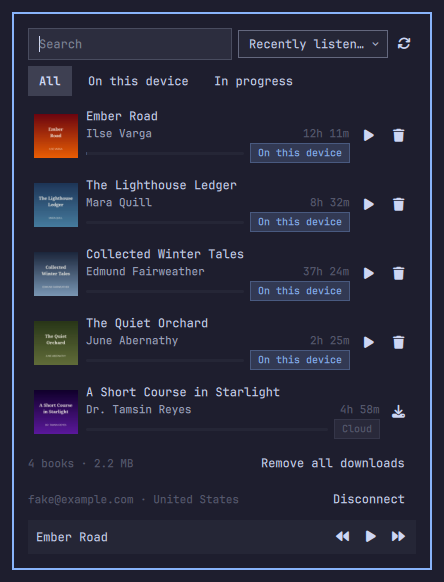

# Omarchy Audible

Your Audible library in the [Omarchy](https://omarchy.org) bar. Click the book icon to browse your library in a drawer that follows your theme, pick a book, and a mini player takes over. Close the panel and the book keeps playing. Your place syncs with the Audible phone app in both directions, and only the books you're listening to are kept on your computer.



- **A library drawer** with search, four sorts (recently listened, recently added, title, author) and filters for downloaded or in-progress books.
- **A mini player** with cover, chapter, back and forward skips, speed, scrub and Stop. Open the full view for the chapter list and a sleep timer.
- **Downloads on demand.** A book downloads only when you pick it, and one click removes it from your computer again. Removing never touches your Audible account.
- **Your place follows you.** Start on your phone and carry on here at the same spot, or the other way round.
- **Sign in from the drawer.** Amazon's own sign-in page opens in your browser, so passwords, passkeys, two-step codes and captchas all stay there.
- **Playback survives** closing the panel and restarting the shell.
- **Optional media keys** and Omarchy's media widget through `mpv-mpris`.

> This is an unofficial project, not affiliated with Audible or Amazon. Read the [Notice](#notice) before you install it.

## Install

You need Omarchy 4.0.4 or newer and an Audible account.

```sh
omarchy plugin add https://github.com/latentoperator/omarchy-audible --enable --yes
```

The book icon appears on the right of the bar. Click it, and the drawer walks you through three steps:

1. **Missing tools.** If `mpv` or `ffmpeg` is missing, the drawer shows the `omarchy pkg add …` command to run in a terminal. **Copy command** puts it on the clipboard and **Check again** re-checks. A standard Omarchy install already has both.
2. **Set up.** Builds the plugin's private Python environment in about a minute. [What setup installs](#what-setup-installs) lists exactly what it downloads and writes.
3. **Connect Audible.** Pick your country and click **Connect Audible**, then sign in to Amazon in the browser tab that opens. It ends on a "page not found" page: copy that page's address and paste it into the drawer. If you already use [audible-cli](https://github.com/mkb79/audible-cli), **Use existing audible-cli login** reuses that login instead.



Your library appears once the first sync finishes. Pick a book and click **Download**; when it's on this device, pick it again to play.

To update to the latest version:

```sh
omarchy plugin update latentoperator.audible
```

## Use

| | |
|---|---|
|  | Playing a book opens the **mini player**. Space plays or pauses, ← and → skip back and forward, and **Stop** saves your place and ends playback. Press Esc or click away to hide it; the book keeps playing, and the bar icon brings it back. |
|  | The **Full player** button opens the full view: chapter list, speed (presets, or fine steps of 0.05×), sleep timer (15 to 60 minutes, or end of chapter), and **Remove from this device**. Backspace returns to the mini player. |
|  | The **library drawer**. Type to search, ↑ and ↓ to move, Enter to pick a book, Esc to close. Space plays or pauses while the search box is empty. The footer shows how much space downloaded books use, with **Remove all downloads** and **Disconnect**. |

A middle click on the bar icon plays or pauses the loaded book.

When you play a book, the plugin checks Audible for a newer position from another device and moves there if it finds one. While you listen, it sends your position back about once a minute and again when you pause or stop, so your phone can pick up where you left off. Whichever device you listened on most recently wins: the plugin never overwrites a position from more recent listening on another device.

Without a network connection, downloaded books still play and the drawer shows the last synced library, with cloud books marked **Offline**. A book that has left your Audible library but is still downloaded stays playable and is marked **No longer in your Audible library**.

## Hotkeys and IPC

The plugin adds no key bindings of its own. It exposes one IPC target that you can drive from a terminal or bind to a key:

```sh
omarchy-shell latentoperator.audible <method> [args]
```

| Method | Meaning |
|---|---|
| `toggle` | Toggle the drawer on the primary bar widget |
| `openLibrary` | Open the drawer on the primary bar widget |
| `playPause` | Toggle play/pause for the loaded book |
| `skip <seconds>` | Seek by a signed number of seconds, e.g. `skip -15` |
| `nextChapter` | Jump to the next chapter |
| `prevChapter` | Jump to the previous chapter |
| `stop` | Stop playback and save the current position |

Every method returns a short string: `ok` on success, or an error such as `error: nothing loaded`. `playPause` can also return `busy` or `cancelled` while it is reading a newer position from Audible.

To bind one, add a line to `~/.config/hypr/bindings.lua`. That file is yours, and this project never edits it. Pick a free combination (`omarchy menu keybindings --print` lists the ones in use), for example:

```lua
o.bind("SUPER + ALT + A", "Audible", "omarchy-shell latentoperator.audible toggle")
```

The target also has read-only status methods, such as `playerStatus`, and test methods. The test methods only work in the plugin's development fake mode; otherwise they return `error: dev only`. `qs ipc show` lists them all.

## Media keys (optional)

Install `mpv-mpris` with `omarchy pkg add mpv-mpris`, then start a book. New players expose the book to Omarchy's stock media widget and the keyboard play/pause keys; the widget can play, pause and seek. A player started before installing the package needs a Stop and a new play to load the MPRIS script. Next and Previous do not change audiobook chapters. Resuming with a media key or widget after a long pause skips the plugin's account catch-up read; later position pushes still follow the stale-position protection rules. Stop from the media widget saves your place and stops playback; after a shell restart it saves and stops but leaves the idle player running until the next book. A seek made through MPRIS while paused is not currently saved as a user move if playback is stopped before resuming.

## Settings

Settings are plain JSON keys on this plugin's entry in `~/.config/omarchy/shell.json`, under `bar.layout.<section>`. For example, inside the relevant section's widget array:

```json
{
  "id": "latentoperator.audible",
  "skipSeconds": 30,
  "defaultSort": "Title",
  "defaultSpeed": "1.5×"
}
```

Save the file and Omarchy applies the values live; no shell restart is needed. There is no settings UI for `barWidget.schema` in Omarchy 4.0.4. The manifest schema documents the key types, ranges, choices and defaults.

| Key | Type and accepted values | Default | Meaning |
|---|---|---|---|
| `skipSeconds` | Integer or digit string, 5–120 | `15` | Seconds for back/forward skips. Any integer in range is accepted. |
| `defaultSort` | Sort label, case-insensitive: Recently listened, Recently added, Title, Author | `Recently listened` | Initial drawer sort; the user's drawer choice lasts for the session. |
| `autoRemoveFinished` | `On`/`Off` in any case, or JSON `true`/`false` | `Off` | Remove a finished local book. |
| `showTitleInBar` | `On`/`Off` in any case, or JSON `true`/`false` | `Off` | Show the playing book's title beside the bar icon. |
| `defaultSpeed` | Number or string matching a preset; optional trailing `×`, `x` or `X` | `1.0×` | Starting speed. A changed value applies and saves; an unchanged value preserves the speed chosen with the pill. |
| `syncOnOpenHours` | Integer or digit string, 1–48 | `6` | Minimum interval between automatic catalog syncs. Any integer in range is accepted. |
| `booksDir` | Absolute path or `~/…` | `~/Audiobooks/Audible` | Books folder; empty values use the default, unsafe folders fall back to it, and existing books are not moved (the plugin tells you how many were left behind). |

`booksDir` trims surrounding whitespace. `~` and `~/…` use your home folder; other `~user` and `$VAR` forms are not expanded. The backend rejects non-absolute paths, `/`, your home folder, plugin/configuration/runtime/venv folders, `~/.audible`, system directories, existing non-directories, and paths below an existing non-directory; symlinks are checked by their target, while a not-yet-existing folder is allowed. Books already downloaded are not moved; the plugin tells you how many were left behind.

Speed is snapped only when it matches a preset (`0.75`, `1.0`, `1.25`, `1.5`, `1.75`, `2.0`, `2.5`, `3.0`); invalid or out-of-range values use the default. Invalid integers, sort labels and On/Off values also use their defaults.

## What setup installs

The plugin itself is QML and Python source. Nothing is compiled, and the plugin never asks for administrator rights. The only third-party code comes from the **Set up** step in the drawer (or `omarchy-audible setup` in a terminal), which:

1. Creates a Python virtual environment at `~/.local/share/omarchy-audible/venv` with your system `python3`.
2. Runs `pip install -r backend/requirements.lock` inside it. That downloads two packages from [PyPI](https://pypi.org) at pinned versions, [`audible-cli`](https://pypi.org/project/audible-cli/) 0.6.0 and [`audible[cryptography]`](https://pypi.org/project/audible/) 0.12.0 (both AGPL-3.0, by mkb79), plus the libraries they depend on: about 30 packages and 75 MB in all. The two named packages are pinned by version, not by hash, and their dependencies resolve to current releases.
3. Installs this repository's `backend/` package into the same environment. pip fetches the `hatchling` build tool from PyPI to do it.
4. Imports `audible` and the backend once to prove the environment works, then writes a ready marker.

Setup runs once. Running it again does nothing unless `backend/requirements.lock` has changed, A run that fails removes the half-built environment, and a run that was interrupted is cleaned up by the next one, so setup always starts clean. Nothing is installed system-wide.

**Network traffic after setup** goes only to Amazon and Audible: sign-in, library sync, cover images, book downloads, and reading and writing your listening position. All of it comes from the Python backend; the shell side of the plugin makes no network requests.

**System tools it uses**, none of which it installs: `python3`, `mpv` and `ffmpeg`/`ffprobe`, plus `wl-copy`/`wl-paste`, `xdg-open`, `notify-send`, and `systemd-run --user`/`systemctl --user`, which run and stop the player in its own user scope. All ship with Omarchy. `mpv-mpris` is optional.

**Files it writes:**

| Path | What |
|---|---|
| `~/.local/share/omarchy-audible/` | The setup environment (`venv/`), the library catalog, cover images, and listening state |
| `~/.config/omarchy-audible/` | Your Audible login, written `0600` in a `0700` folder |
| `~/Audiobooks/Audible/` (or `booksDir`) | One folder per downloaded book |
| `$XDG_RUNTIME_DIR/omarchy-audible/` | The player socket and job lock, which do not survive a reboot |
| `~/.config/omarchy/shell.json` | Omarchy's own record of the bar entry and its settings |

It reads `~/.audible` only if you choose **Use existing audible-cli login**, and never writes there.

## Remove

1. Click **Stop** in the player, so no player is left running.
2. Optionally, click **Remove all downloads** in the drawer to delete the books from this computer. Your Audible library is not affected.
3. Click **Disconnect**. This removes the plugin's login and, if you signed in through the drawer, deregisters this computer from your Amazon account. An imported audible-cli login stays registered, because audible-cli still uses it. Downloaded books stay unless you removed them in step 2.
4. Remove the plugin. This takes the icon off the bar and deletes the plugin folder:

   ```sh
   omarchy plugin remove latentoperator.audible
   ```

5. Delete what setup and the plugin wrote:

   ```sh
   rm -rf ~/.local/share/omarchy-audible ~/.config/omarchy-audible
   rm -rf ~/Audiobooks/Audible   # or your booksDir; only if you also want the downloaded books gone
   ```

Deregistering needs a network connection. If you remove the plugin without disconnecting, or disconnect while offline, this computer can stay listed as a device on your Amazon account. You can deregister it from Amazon's **Manage Your Content and Devices** page.

## FAQ

**Does removing a book delete it from Audible?**
No. **Remove from this device** and **Remove all downloads** delete only the files on this computer. The book stays in your Audible library as a cloud book, and downloading it again resumes where you were.

**Does it change anything on my Audible account?**
Two things. It writes your listening position, but never over a position from more recent listening on another device. Signing in from the drawer also registers this computer as a device on your account, as the phone app does, and **Disconnect** removes it. It never buys, returns, rates or deletes anything.

**Are my books stored unlocked?**
No. Each book is stored exactly as Audible sent it (`book.aaxc` or `book.aax`). The key that plays it is kept in a `0600` file (beside the book, or for older `aax` books with your login) and is used only in memory while the book plays. No decrypted copy is ever written to disk, and there is no export.

**Does the plugin see my Amazon password?**
No. You sign in on Amazon's own page in your browser, so the plugin never sees your password, passkey or two-step code. It keeps the device login Amazon issues, in `~/.config/omarchy-audible/` with mode `0600`, and never logs it or shows it in the drawer.

**Which countries work?**
The Audible stores in the United States, United Kingdom, Germany, France, Canada, Italy, Australia, India, Japan, Spain and Brazil. Pick yours in the **Connect Audible** step.

**Can it play books I downloaded some other way?**
No. It plays the books it downloaded itself.

**It says "Audible connection problem".**
Audible returned something the plugin didn't expect. Downloaded books still play from the saved library. **Copy diagnostic** copies a short report with credentials removed; include it if you open an issue.

**How do I check my setup?**
Run `~/.config/omarchy/plugins/latentoperator.audible/bin/omarchy-audible doctor` in a terminal. It checks each tool, the environment and the login, and says what is missing.

## Backend CLI

The drawer drives everything through one command, `bin/omarchy-audible`. You can run it yourself to test or script. Every command prints one JSON object per line on stdout and ends with exactly one `done` or `error` line. Human-readable logs go to stderr and never contain credentials, sign-in links or decryption keys.

Exit codes: `0` ok, `1` failed, `2` bad arguments, `3` busy (another job is running). Errors look like `{"type":"error","code":"bad_asin","message":"…","hint":"…"}`.

Add `--fake` (or set `OMARCHY_AUDIBLE_FAKE=1`) to any command to run against a built-in fake library with no network and no account. Real paths follow XDG: login in `~/.config/omarchy-audible/`, catalog and covers in `~/.local/share/omarchy-audible/`, books in `~/Audiobooks/Audible/` (override with `OMARCHY_AUDIBLE_BOOKS_DIR`). Fake mode uses a separate tree (`~/.config/omarchy-audible-fake/`, `~/.local/share/omarchy-audible-fake/`, books in `~/.local/share/omarchy-audible-fake/books`) so it never reads or writes the real login, catalog or books. It honours a books-folder override only when it resolves strictly inside the fake data directory; an outside value is ignored and reported as a problem.

Fake mode also carries its own onboarding state, so the sign-in and setup screens can be tested without an account. A fresh fake tree starts signed in; `logout --fake` signs the fake account out and `login-finish --fake` / `login-import-cli --fake` sign it back in (fake `login-finish` accepts any pasted text containing `openid.oa2.authorization_code=`). To preview the missing-tools or setup screen, write `~/.config/omarchy-audible-fake/fake-status.json` with `{"missing": ["mpv"]}` or `{"venv_ready": false}` (both keys optional), and delete it afterward; `setup --fake` clears the `venv_ready` override again. Real mode reads neither the marker nor `fake-status.json`.

To exercise the player against a long book, fake `get <asin> --fake-chapters 120` (or `OMARCHY_AUDIBLE_FAKE_CHAPTERS=120`) writes 120 evenly spaced chapters instead of the default 5; the range is 1–500, and real mode ignores it. Fake `get` also fakes the failures that matter: `--fake-fail disk` (the volume is treated as nearly full), `network` (the download breaks part-way), `decrypt` (the voucher arrives without key/iv) and `novoucher` (no aaxc voucher, so the aax fallback runs).

For Library error states, fake `sync --fake-fail network|internal` exercises offline and connection-problem UI. Fake `sync --fake-hide <asin>` persistently hides a fixture book until `~/.config/omarchy-audible-fake/fake-hidden-asins.json` is removed. These controls work only in fake mode.

**Setup and health**

```sh
omarchy-audible setup     # build the private Python env (audible-cli 0.6.0, audible 0.12.0); a second run does nothing
omarchy-audible status    # {"type":"status","ready":true,"authenticated":true,"marketplace":"us","account":"c…@…",…}
omarchy-audible doctor    # checks python, mpv, ffmpeg/ffprobe, wl-paste, xdg-open, systemd-run, the env and the login
```

**Sign in** (all password, passkey, 2FA and captcha steps happen in your own browser)

```sh
omarchy-audible login-start --marketplace us
#  {"type":"login_url","url":"https://www.amazon.com/ap/signin?…","session":"<id>"}
#  open the url, sign in; Amazon ends on a "page not found" page: copy that address
omarchy-audible login-finish --session <id>   # paste the address on stdin, then Ctrl-D
#  the link is read from stdin, never as an argument; the session expires after 10 minutes
omarchy-audible login-import-cli              # or: reuse an existing audible-cli login from ~/.audible
omarchy-audible logout
```

Login files are written `0600`. If the copied link is still in Omarchy's clipboard history, `login-finish` says so in its `done` line (`"clipboard_history_contains_code": true`) so you can clear it from the clipboard menu. `logout` removes this device from your Amazon account only if it was created by `login-finish`; an imported audible-cli login is never deregistered, because audible-cli still uses it. Downloaded books are kept either way.

**Library and books**

```sh
omarchy-audible sync [--full]       # refresh the catalog, missing covers and Audible's positions; never sends positions
omarchy-audible get <asin>          # download the locked original (aaxc, falls back to aax) → {"type":"done","path":"…/book.aaxc"}
omarchy-audible play-info <asin>    # how to play a local book: {"type":"play_info","path":"…","chapters_file":"…"|null,"lavf_options":"…"}
omarchy-audible cancel <asin>       # stop a running get and clean up its partial files
omarchy-audible local               # includes cached title, length and authors when meta.json has them
omarchy-audible remove <asin>       # delete the book from this computer only → {"type":"done","freed_bytes":…}
```

`get` checks free space first, reports `progress` lines while it works, and refuses anything that isn't a plain ASIN (`error` code `bad_asin`). **It does not store a decrypted copy**: the book directory keeps the file exactly as Audible sent it (`book.aaxc` or `book.aax`), the key material in a `0600` `key.json`, the chapter list in `chapters.txt` and the metadata in `meta.json`. No `.m4b` is written, and the download needs about 1.1× the book's size free rather than twice it. `play-info` then hands the player the audio path, the chapter file and the ready-made mpv option that unlocks it in memory; those key options are a secret, are never logged, and are not part of any command line. Old `book.m4b` downloads keep playing as before. `remove` never touches your Audible account or library.

Downloaded books missing from a later Audible catalog sync stay in the drawer. Their local metadata supplies the title, length and authors when available; otherwise the ASIN is shown. They can be played or removed from this device, and don't offer a download action.

**Listening positions**

```sh
omarchy-audible position-get <asin> [<asin>…]          # {"type":"positions","items":{"<asin>":{"ms":…,"updated_at":"…","own":true?}}}
omarchy-audible position-push <asin> <ms> --at <iso-8601>
```

`position-push` is the only command that changes anything on your Audible account. It re-reads Audible's position first and refuses (`error` code `stale`) if Audible's is newer than your local listening time, so it can't move your phone backwards; `--at` (the local listening time the position came from) is required, and omitting it is `error` code `invalid_args`. Audible stamps a push with its own server clock, so the command also remembers its own writes in `<data dir>/pushed.json` and treats an exactly-matching remote position as its own echo rather than a newer listening. That keeps a computer whose clock runs behind Audible's from locking itself out. `position-get` marks such an echo with `"own": true`. The Audible phone app follows a pushed position on its own, with an undo notice. With `--fake`, positions are kept in `<fake data dir>/fake-account-positions.json` instead of the account, so a push, a resume and the stale check can all be tried with no account.

## Development

The suite has two halves: the Python backend under `tests/`, and the pure `qml/lib/*.js` libraries, which run in PySide6's `QJSEngine`, the same V4 engine Quickshell uses.

```sh
pip install -e '.[dev]'   # pytest, ruff, jsonschema, PySide6-Essentials
make test                 # python -m pytest -q
make lint                 # ruff check ., ruff format --check ., omarchy plugin validate ., no-symlink check
```

The JS suites need PySide6. They **fail** when it is missing rather than skipping, so a missing engine can never leave them silently green; set `OMARCHY_AUDIBLE_ALLOW_SKIP_QJS=1` to skip them on purpose, e.g. on a machine that only runs the Python backend. Tests that build or probe the fake audio (`get`, `cancel`, re-download, `play-info`) need `ffmpeg`/`ffprobe` on `PATH`; where they live elsewhere, point `OMARCHY_AUDIBLE_FFMPEG_DIR` at their directory and it is prepended.

| | |
|---|---|
| [CHANGELOG.md](CHANGELOG.md) | What changed in each release |
| [docs/RELEASING.md](docs/RELEASING.md) | How to cut a release |
| [docs/SCOPE.md](docs/SCOPE.md) | What we're building, for whom, and what we're not |
| [docs/ARCHITECTURE.md](docs/ARCHITECTURE.md) | How it works, verified facts, and open questions |
| [docs/PLAN.md](docs/PLAN.md) | Milestones and tasks with acceptance criteria |
| [docs/WORKFLOW.md](docs/WORKFLOW.md) | How work is run (roles, tools, loop) and how to resume on another machine |
| [docs/STATE.md](docs/STATE.md) | Live status, decisions, and next steps |
| [AGENTS.md](AGENTS.md) | Rules for AI coding agents working in this repo |

## License

[AGPL-3.0-only](LICENSE). The backend imports the AGPL-licensed [`audible`](https://github.com/mkb79/Audible) library, which setup installs on your machine; it is not bundled here.

## Notice

This is an unofficial project and is not affiliated with Audible or Amazon. Audible has no public API for third-party players, so the plugin relies on the community libraries `audible` and `audible-cli` and an unofficial API that may change or stop working at any time. It is intended only for listening to books you have purchased, on your own computer, and it has no feature to share, bulk-export or upload audio. Playing your books here may violate Audible's terms of use and laws in your area. You decide whether to use it, and you are responsible for how you do so.
